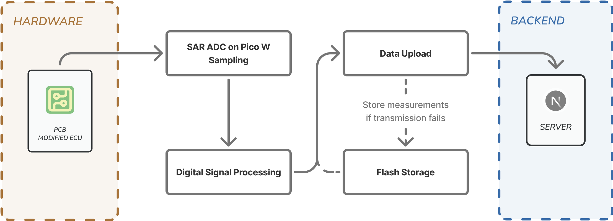

# Firmware Architecture

## Overview
The firmware is designed for the Raspberry Pi Pico W, acting as a wireless data collection module for EVolocity Control Units (ECUs). It gathers sensor data (voltage, current), processes it, and transmits it wirelessly to a central backend server. The system is built using MicroPython and leverages its `asyncio` library for concurrent task management. It also utilises PIO (Programmable Input/Output) for efficient ADC sampling, and includes robust error handling and data buffering mechanisms to ensure reliable operation even in the case of network interruptions.

## System Architecture Diagram



```
[Raspberry Pi Pico W]
├── Main Application (`main.py`)
│   ├── System Initialisation
│   ├── Core Task Orchestration (asyncio)
│   └── Graceful Shutdown & Resource Cleanup
│
├── Core Tasks (`tasks/`)
│   ├── Data Processing (`data_processing.py`)
│   │   ├── Sensor Data Acquisition & Initial Processing
│   │   ├── Measurement Packet Creation & In-Memory Buffering
│   │   └── Persistent Data Storage (Flash Write Operations)
│   └── Data Transmission (`data_transmission.py`)
│       ├── Wireless Network Management (Wi-Fi)
│       ├── Backend Server Discovery (UDP)
│       ├── Data Packet Upload (HTTP, including backlog from Flash)
│       └── System Status Indication (LED)
│
├── Drivers (`drivers/`)
│   ├── ADC Sampler (`adc_sampler.py`)
│   ├── Button (`button.py`)
│   ├── Flash Storage (`flash_storage.py`)
│   ├── PicoZero (`picozero.py`)
│   └── WLAN (`wlan.py`)
│
├── Libraries (`lib/`)
│   ├── Calculations (`calculations.py`)
│   ├── Calibration (`calibration.py`)
│   ├── HTTP (`http.py`)
│   ├── Packer (`packer.py`)
│   ├── Ring Buffer Queue (`ringbuf_queue.py`)
│   ├── TCP (`tcp.py`)
│   ├── ThreadSafe (`threadsafe/`)
│   └── UDP (`udp.py`)
│
└── Configuration (`constants.py`)
```

## Module Descriptions

### Main Application (`main.py`)
This is the main starting point of the firmware and controls its overall operation.
-   It starts up the firmware, getting hardware drivers and necessary services ready.
-   It controls the main tasks that handle collecting, processing, and sending data. These tasks run concurrently (at the same time).
-   It makes sure the firmware shuts down properly, dealing with any errors and freeing up resources like the Wi-Fi connection.

### Core Tasks (`tasks/`)

#### `data_processing.py`
This part collects, processes, and saves sensor readings. It runs as a separate thread so that operations like saving to flash memory (which can be slow) don't block other important tasks.
-   It gets raw data from the ADC (analogueue-to-digital converter) driver.
-   It takes the raw data, does calculations (like averaging voltage and current, or working out power), and puts it into a standard format called a measurement packet.
-   It uses a temporary storage space in memory (a ring buffer) to hold these packets and transfer it to other tasks safely.
-   It saves these packets to the device's flash memory if, for example, the network is down. This prevents data from being lost.

#### `data_transmission.py`
This task handles sending all processed data to the main server.
-   It looks after the Wi-Fi, including connecting and staying connected.
-   It finds the server's IP address on the network using UDP (User Datagram Protocol) messages.
-   It sends groups of measurement packets (both new data from memory and older data from flash storage) to the server using HTTP POST requests.
-   It uses the onboard LED to show the system's status (like whether it's connected to Wi-Fi).
-   It works with the data processing part to manage flash storage, telling it when to save new data or when to get old data ready to send.

### Drivers (`drivers/`)
These are low-level modules that interact directly with the hardware components.

-   **`adc_sampler.py`**: This driver reads analogue sensor inputs, like voltage and current. It uses the Pico's PIO (Programmable I/O) for fast and efficient readings without using too much CPU power for timing.
-   **`button.py`**: This handles presses of a physical button. This can be used to trigger actions, like an identification sequence.
-   **`flash_storage.py`**: This makes it easier to read and write data to the Pico W's flash memory. It usually uses a file as a circular buffer (a fixed-size buffer that overwrites the oldest data when full) to store data when the device isn't connected to the network.
-   **`picozero.py`**: This provides a simple way to control the Pico W's onboard LED, which is used to show system status.
-   **`wlan.py`**: This manages the Wi-Fi connection, including connecting, checking the status, and disconnecting.

### Libraries (`lib/`)
These provide reusable tools and implementations for common tasks.

-   **`calculations.py`**: Includes functions for calculations on sensor data, like working out power and energy from voltage and current.
-   **`calibration.py`**: Contains code for ADC calibration (e.g., DNL - Differential Non-Linearity correction) to make sensor readings more accurate.
-   **`http.py`**: A basic HTTP (Hypertext Transfer Protocol) client that can create and send HTTP POST requests. These requests can include custom headers and binary data, and are used to talk to the backend server.
-   **`packer.py`**: Defines how data packets are structured in binary (a sequence of 0s and 1s). It has functions to convert (pack) data into this binary format for sending, and to convert it back (unpack) if needed.
-   **`ringbuf_queue.py`**: A thread-safe ring buffer, which is an efficient, fixed-size queue. It's used to pass data between different parts of the firmware that run at the same time (e.g., from data processing to data transmission), without data getting mixed up.
-   **`tcp.py`**: Provides basic TCP (Transmission Control Protocol) socket features. TCP is used to create reliable network connections for sending data, and it's what HTTP uses underneath.
-   **`threadsafe/`**: This folder contains tools and data structures that are safe to use when multiple parts of the code run at the same time (concurrently or in multiple threads). This helps avoid errors and keeps data consistent.
-   **`udp.py`**: Provides basic UDP socket features. UDP is used here to send and receive simple messages for discovering services on the network, like finding the backend server.

### Configuration (`constants.py`)
A central place for defining settings and constant values used throughout the firmware.
-   It contains settings like network details (server port), limits for how much data to send at once (batch sizes), and timing values (like how long to wait before retrying a connection).

## Data Flow
This describes how data moves through the system:
1.  **Sensing**: The `adc_sampler.py` driver continuously reads voltage and current from the ADC pins using the Pico's PIO.
2.  **Processing**: The `data_processing.py` task takes the averaged ADC readings, calculates power and energy, and creates structured binary data using the `lib/packer.py` library.
3.  **Buffering (Memory)**: These packets are added to a temporary in-memory queue (`lib/ringbuf_queue.py`).
4.  **Transmission Attempt**: The `data_transmission.py` task takes packets from this queue.
    *   It checks the Wi-Fi connection (using `drivers/wlan.py`).
    *   It finds the server's IP address using UDP broadcasts (with `lib/udp.py`).
    *   It groups packets together and sends them to the server using HTTP POST requests (via `lib/http.py` and `lib/tcp.py`).
5.  **Buffering (Flash)**:
    *   If the server can't be reached or an HTTP POST request fails, the `data_transmission.py` task tells the `data_processing.py` task.
    *   The `data_processing.py` task then saves the unsent packets to the device's flash memory using `drivers/flash_storage.py`.
6.  **Backlog Processing**: When the connection to the server is back, the `data_transmission.py` task sends the data stored in flash memory first. It reads this data in larger groups using `drivers/flash_storage.py`.

## Communication Protocols
Refer to `ECU_PROTOCOL.md` for detailed information on:
-   Wi-Fi and TCP/IP setup.
-   UDP server discovery mechanism.
-   HTTP POST request structure for data transmission.
-   Binary measurement packet format.

## State Management & Concurrency
-   The system relies on `asyncio` for cooperative multitasking. `main.py` sets up and runs the primary asynchronous tasks.
-   The `data_processing` task, which includes ADC sampling and initial processing, runs in a separate thread (`_thread.start_new_thread`) to avoid blocking `asyncio` tasks with potentially CPU-intensive operations or synchronous file I/O to flash.
-   Inter-task/thread communication primarily uses the `ringbuf_queue` for measurement data and potentially shared flags or events for control signals (e.g., `should_exit_program`).
-   LED indicators provide visual feedback on the system's state (Wi-Fi connection, server connection).
